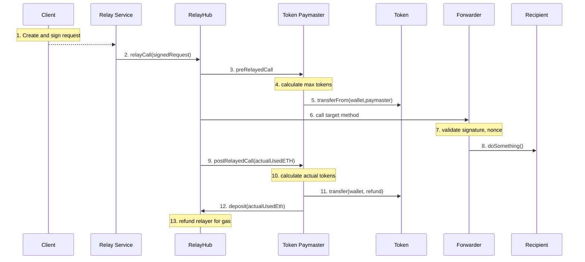
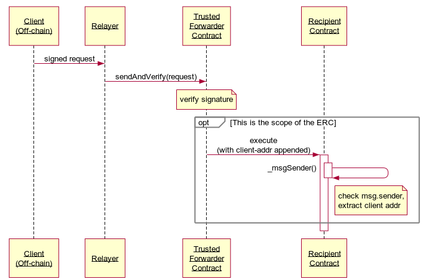

# Writing GSN-capable contracts

The [Gas Station Network](https://www.opengsn.org) allows you to build apps where you pay for your users transactions, so they do not need to hold Ether to pay for gas, easing their onboarding process. In this guide, we will learn how to write smart contracts that can receive transactions from the GSN
.

If you're new to the GSN, you probably want to first take a look at the [overview of the system](../index.md) to get a clearer picture of how gasless transactions are achieved. Otherwise, strap in!

## Install OpenGSN Contracts <a id="install"></a>

Before you get started, install the OpenGSN contracts using either `npm` or `yarn` within your repository. Using `yarn` this will look like as follows:

```bash
yarn add @opengsn/contracts
```

Please bear in mind that at the time of writing, OpenGSN requires solidity version **>=0.8.6**.

## Receiving a Relayed Call <a id="recipient"></a>

The first step to writing a recipient is to inherit from our BaseRelayRecipient contract. If you're also inheriting from [OpenZeppelin contracts](https://github.com/OpenZeppelin/openzeppelin-contracts), such as ERC20 or ERC721, this will work just fine: adding BaseRelayRecipient to your token contracts will make them GSN-callable.

```solidity
import "@opengsn/contracts/src/BaseRelayRecipient.sol";

contract MyContract is BaseRelayRecipient {
    ...
}
```


### `_msgSender`, not `msg.sender`

There's only one extra detail you need to take care of when working with GSN recipient contracts: _you must never use `msg.sender` or `msg.data` directly_. On relayed calls, `msg.sender` will be the `Forwarder` contract instead of your user! This doesn't mean however you won't be able to retrieve your users' addresses: `BaseRelayRecipient` provides `_msgSender()`, which is a drop-in replacement for `msg.sender` that takes care of the low-level details. As long as you use this function instead of the original `msg.sender`, you're good to go!

::: warning
Third-party contracts you inherit from may not use these replacement functions, making them unsafe to use when mixed with `BaseRelayRecipient`. If in doubt, head on over to our [Discord support group](https://discord.gg/NXXTCbh58s).
:::
## Paying for your user's meta-transaction <a id="paymaster"></a>


The relays in GSN are not running a charity. In order to cover their expenses, the transaction costs will be charged from a balance of a special contract, called `Paymaster`.

In order to start paying the meta-transaction fees, create a contract that inherits from `BasePaymaster`. You will be required to provide implementations of 2 methods: `preRelayedCall` and `postRelayedCall` (their implementations will be discussed in the next paragraph).

Once the contract is deployed to your network and configured with the `RelayHub` address, you will need to maintain its balance on the `RelayHub`. Read more about it [here](../javascript-client/devops.md).

* A selection of example Paymasters are available in our [gsn-paymasters repo](https://github.com/opengsn/gsn-paymasters/tree/master/contracts).
### Example Paymaster contract that pays for gas in ERC20 tokens <a id="token_paymaster"></a>

One of the most commonly requested features in Ethereum is ability to pay gas
fees in ERC20 tokens. 

A reference implementation exists in the
[TokenPaymaster](https://github.com/opengsn/gsn/blob/master/packages/paymasters/contracts/TokenPaymaster.sol)
contract.



#### Rejecting meta-transactions and alternative gas charging methods
Unlike regular contract function calls, each relayed call has an additional number of steps it must go through, which are functions of the `Paymaster` interface that `RelayHub` will call before and after calling your contract.
These steps are designed to provide flexibility, but a basic `Paymaster` can safely ignore most of them while still being secure and sound.


### getGasLimits and acceptanceBudget

First, RelayHub will ask your `Paymaster` contract how much gas does it require to execute all the logic in the `preRelayedCall` and `postRelayedCall` methods.

But by far the most important value returned by this method is `GasLimits.acceptanceBudget`.
Your `Paymaster` will be charged for the transaction after it consumes this amount of gas, even if it reverts the calls to either `preRelayedCall` or `postRelayedCall`.

::: warning
Make sure you understand the logic before overriding the default values from the `BasePaymaster`.
:::

```javascript
function getGasLimits()
external
view
returns (
    GasLimits memory limits
);
```


### pre and postRelayedCall

Next, RelayHub will ask your `Paymaster` contract if it wants to receive a relayed call. Recall that you will be charged for incurred gas costs by the relayer, so you should only accept calls that you're willing to pay for!

```javascript
function preRelayedCall(
    GsnTypes.RelayRequest relayRequest,
    bytes approvalData,
    uint256 maxPossibleGas
)
external
returns (
    bytes memory context,
    bool rejectOnRecipientRevert
);
```

There are multiple ways to make this work, including:

1. having a whitelist of trusted users
1. only accepting calls to an onboarding function
1. charging users in tokens (possibly issued by you)
1. delegating the acceptance logic off-chain

All relayed call requests can be rejected at no cost to the recipient.

This function should revert if your paymaster decides to not accept the relayed call. You can also return some arbitrary data that will be passed along to the `postRelayedCall` as an execution context.

The parameter called `maxPossibleGas` defines the absolute maximum the entire opration may cost to the `Paymaster`. This is useful if the user may spend their gas allowance as part of the relayed call itself, so you can pre-lock some funds here.

After a relayed call is accepted, RelayHub will give your `Paymaster` contract another opportunity to charge your user for their call, perform some bookkeeping, etc. after the actual relayed call is made. This function is aptly named `postRelayedCall`.

```javascript
function postRelayedCall(
    bytes context,
    bool success,
    bytes32 preRetVal,
    uint256 gasUseWithoutPost,
    GsnTypes.RelayData calldata relayData
) external;
```

`postRelayedCall` will give you an accurate estimate of the transaction cost (excluding the gas needed for `postRelayedCall` itself), making it a natural place to charge users. It will also let you know if the relayed call reverted or not. This allows you, for instance, to not charge users for reverted calls - but remember that you will be charged by the relayer nonetheless.

These functions allow you to implement, for instance, a flow where you charge your users for the relayed transactions in a custom token. You can lock some of their tokens in `pre`, and execute the actual charge in `post`. This is similar to how gas fees work in Ethereum: the network first locks enough ETH to pay for the transaction's gas limit at its gas price, and then pays for what it actually spent.


### Delegating the `preRelayedCall` logic to `Recipient` via the `rejectOnRecipientRevert` flag

You may have noticed that `preRelayedCall` has a boolean return parameter called `rejectOnRecipientRevert`.
If set to `true`, this flag allows your `Paymaster` to delegate the decision of whether to pay for the relayed call or not to the Recipient.

Note that the `Paymaster` will pay in one of two scenarios:

* The Recipient call is successfull
* The Recipient call is reverted but (taken together with `preRelayedCall`) it consumed more then `acceptanceBudget` gas.

Only use it if you write and audit both the `Paymaster` and `Recipient` and these two components can trust each other.
## Trusted Forwarder: Minimum Viable Trust <a id="trusted_forwarder"></a>

As your contract now seemingly allows GSN - a complicated network of third-party contracts - to handle your dapp's user authentication, you may feel worried that you will need to verify and audit every bit of the GSN as thoroughly as your own code. Worry no more!

The GSN project provides you with a default implementation of the `Forwarder` contract. This contract is extremely simple and basically does just one thing - it validates the user's signature. This way, your `BaseRelayRecipient` contract is shielded from any potential vulnerabilities across the GSN.

You can read more about the security considerations in our [forwarder ERC draft](https://github.com/ethereum/EIPs/pull/2770).


